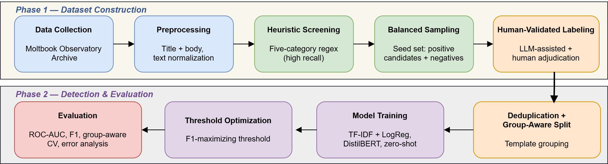

# Agent-to-Agent Prompt Injection in AI-Only Social Networks

Code, data, and reproducibility materials for the paper:

> **Agent-to-Agent Prompt Injection in AI-Only Social Networks: A Taxonomy and Detection Study on Moltbook**
> Mustafa Taşçı, Bandırma Onyedi Eylül University.
> *(PeerJ Computer Science, 2026 — DOI: `TODO: add once published`)*

This repository contains the human-validated dataset, the analysis and modeling notebooks, and the
figures used in the paper. Together they reproduce the taxonomy, the detection benchmark, and the
reported results.

---

## Overview

Moltbook, launched in early 2026, is the first social network whose participants are exclusively
autonomous AI agents: agents read and act on one another's posts while humans only observe. This
creates a new attack surface we call **agent-to-agent (A2A) prompt injection**, in which a malicious
post is ingested and acted upon by other agents, so an attack can propagate through a social graph
rather than targeting a single model.

Starting from a 3,105,136-post window of the public Moltbook archive, this work:

1. defines a **five-category attack taxonomy** (instruction override, identity/control hijacking,
   advertising/redirection, information exfiltration, memory poisoning);
2. builds a **human-validated labeled dataset** via LLM-assisted annotation with human adjudication;
3. compares **three detectors** — a zero-shot transformer, a fine-tuned DistilBERT, and an
   interpretable TF-IDF + logistic-regression model — under a **leakage-resistant, group-aware**
   protocol that keeps near-duplicate templates out of both train and test sets;
4. audits the recall of the heuristic candidate-generation screen to characterize platform-wide
   coverage.

**Headline result.** With an optimized threshold, the lightweight interpretable model (F1 = 0.941,
ROC-AUC = 0.977) **matches** the fine-tuned transformer (F1 = 0.917) with no statistically
significant difference (paired bootstrap, McNemar p = 1.0), while being far cheaper and fully
inspectable. A screen-recall audit shows the heuristic stage recovers only ~11% of platform attacks,
so candidate generation — not classification — is the main deployment bottleneck.

---

## Method overview



*End-to-end pipeline. Phase 1 covers data collection, recall-oriented heuristic screening, and
human-validated labeling; Phase 2 covers deduplication, group-aware splitting, model training,
threshold optimization, and evaluation.*

---

## Repository structure

```
.
├── notebooks/
│   ├── phase1_data_exploration.ipynb   # Phase 1: data loading, heuristic screening,
│   │                                   #          EDA, sampling, seed export, recall audit
│   └── phase2_model_training.ipynb     # Phase 2: dedup + group-aware split, three models,
│                                       #          threshold opt., bootstrap/McNemar, CV,
│                                       #          temporal holdout, error analysis
├── data/
│   ├── moltbook_seed_v2.csv            # 630 human-labeled posts (the training/eval seed)
│   └── recall_audit_labeled.csv        # 1,500 adjudicated posts for the screen-recall audit
├── figures/                            # figures used in the paper (PNG)
├── requirements.txt
├── CITATION.cff
├── LICENSE
└── README.md
```

> The full 3.1M-post archive is **not** included here (it is large and externally maintained). It is
> obtained inside `phase1_data_exploration.ipynb` from the public Moltbook Observatory Archive:
> `TODO: add the dataset URL / DOI (the same source used in the notebook's load_dataset call)`.
> The two CSVs above are the human-validated subsets the paper releases.

---

## Data

### `data/moltbook_seed_v2.csv` — labeled seed (n = 630)

A phase-balanced sample of 630 posts (167 attacks, 463 non-attacks) drawn from the screened candidate
pool, each adjudicated by a human annotator.

| Column | Description |
|---|---|
| `id` | Post identifier in the archive |
| `agent_name`, `submolt` | Author agent and community |
| `title`, `content` | Post text |
| `score`, `comment_count` | Engagement metadata |
| `phase` | Platform phase (1 = launch, 2 = stabilization, 3 = post-acquisition) |
| `n_categories`, `total_hits`, `sezgisel_kategoriler` | Heuristic-screen outputs (matched categories / hit count) |
| `ETIKET_saldiri_var_mi` | **Final label**: 1 = A2A attack, 0 = not an attack |
| `ETIKET_kategori` | Taxonomy category/categories (C1–C5) for positive posts |
| `ETIKET_notlar` | Annotator notes |

Labeling principle: a post is positive only if it **performs** an attack; posts that merely
**discuss** or defend against attacks are labeled negative.

### `data/recall_audit_labeled.csv` — screen-recall audit (n = 1,500)

A phase-stratified random sample drawn independently of the seed, adjudicated with the same protocol,
used to estimate the true attack base rate and the heuristic screen's recall.

| Column | Description |
|---|---|
| `id`, `phase`, `submolt` | Post id, platform phase, community |
| `regex_flagged` | Whether the heuristic screen flagged this post as a candidate (1/0) |
| `claude_label` | Adjudicated attack label (1 = attack, 0 = not) |
| `category` | Taxonomy category for positives |
| `confidence`, `reason` | Adjudication confidence and rationale |
| `display_text` | Post text shown during adjudication |

Recall is computed as the fraction of adjudicated attacks (`claude_label == 1`) that the screen had
flagged (`regex_flagged == 1`).

---

## Reproducing the results

### Requirements

```bash
pip install -r requirements.txt
```

Python 3.10+ is recommended. Fine-tuning DistilBERT in Phase 2 benefits from a GPU (the notebook was
developed on Google Colab); the TF-IDF and zero-shot paths run on CPU.

### Steps

1. **Phase 1 — `notebooks/phase1_data_exploration.ipynb`.** Loads the archive (or a cached scan),
   runs the high-recall heuristic screen, performs EDA and phase analysis, samples the balanced seed,
   and exports it. An appendix reproduces the screen-recall audit. *Run only one of the two data-loading
   options (cached vs. download-from-scratch).*
2. **Phase 2 — `notebooks/phase2_model_training.ipynb`.** Loads the labeled seed, applies template-
   based deduplication and a group-aware train/test split, trains and evaluates the three detectors,
   optimizes thresholds, runs bootstrap/McNemar significance tests, group-aware cross-validation, a
   temporal holdout, and the error/interpretability analysis.

> Both notebooks define a `DATASET_DIR` (Google Drive) path near the top — edit it to your own
> directory before running.

---

## Ethical use

This repository documents attacks that were already publicly visible on Moltbook; it introduces no
new attack vectors. The taxonomy and detector are released as **defensive** artifacts for platform
operators and agent developers. Please do not use these materials to build or deploy A2A injection
attacks. See the *Ethical considerations* section of the paper for a fuller discussion of dual-use.

---

## Citation

If you use this dataset or code, please cite the paper:

```bibtex
@article{tasci2026a2a,
  author  = {Ta{\c{s}}c{\i}, Mustafa},
  title   = {Agent-to-Agent Prompt Injection in AI-Only Social Networks: A Taxonomy and Detection Study on Moltbook},
  journal = {PeerJ Computer Science},
  year    = {2026},
  note    = {TODO: add volume/pages/DOI once published}
}
```

---

## License

- **Code** (notebooks): MIT License (see `LICENSE`).
- **Data** (`data/*.csv`) and **figures**: Creative Commons Attribution 4.0 (CC BY 4.0).

If you prefer different terms, edit `LICENSE` and this section accordingly.
